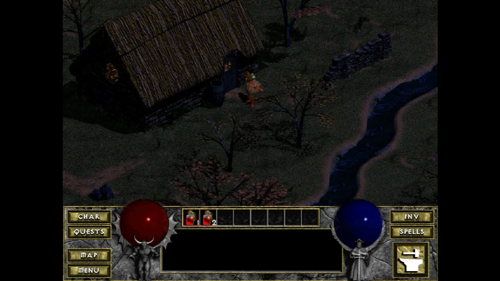

# pi-devilutionx

DevilutionX — the open-source rebuild of Blizzard's *Diablo* (1996) — running
on a Raspberry Pi with **no operating system**. The board boots straight into
the game.

There is no Linux here, no window manager and no shell. The build produces a
single kernel image per board. The Raspberry Pi firmware loads it, it brings
up the hardware itself, and it calls the game.

* The game is [DevilutionX](https://github.com/diasurgical/devilutionX),
  included as a submodule and **never modified**.
* The SDL2 it runs on is [circle-libsdl2](https://github.com/Xalior/circle-libsdl2),
  an SDL2-compatible layer over the [Circle](https://github.com/rsta2/circle)
  bare-metal framework.
* Everything this repository adds of its own is in `host/`.

Supported boards: **Raspberry Pi 3, Pi 4 and Pi 5** (and the Compute Modules
and the Zero 2 W, which share their silicon). Each board gets its own image.



*Captured from the Pi 5's HDMI output. The board is running this image and
nothing else — no kernel underneath it, no window system, no launcher.*

## What works

Diablo plays: the menus, the town, the dungeon, combat and saving.

- **Picture.** Scaled to your screen.
- **Mouse and keyboard.** Both, which this game needs — it is played with the
  mouse from the menus to the fighting.
- **Game controllers.** USB pads.
- **Saved games.** Written back to the SD card.

What is missing:

- **Sound.** The game runs silent.
- **Multiplayer.** Single player only.
- **The on-screen touch gamepad.** It needs a touchscreen, and there is none.

One oddity worth knowing: a Raspberry Pi has no battery-backed clock, so every
saved game from the same image carries the same timestamp.

## What you need

**A cross compiler.** The Arm GNU toolchain for the `aarch64-none-elf` target,
release 15.2.Rel1, built for the machine you compile on. Download it from
[Arm's toolchain
downloads](https://developer.arm.com/downloads/-/arm-gnu-toolchain-downloads)
and either put its `bin/` directory on your `PATH`, unpack it into
`toolchains/` in this repository, or set `RAPI_TOOLCHAIN_DIR` to where it
lives. `mk/toolchain.mk` explains the search order.

**On macOS, three GNU tools from Homebrew**: `gnu-getopt`, `bash` (version 5
or later) and `cmake`. The dependency build needs them; `mk/toolchain.mk`
finds them where Homebrew puts them.

**Disk space.** The dependency build compiles a complete C and C++ standard
library for each of the three boards. Expect several gigabytes.

## Building

```
git clone --recursive https://github.com/Xalior/pi-devilutionx.git
cd pi-devilutionx
make deps        # once, and it takes a long time
make kernels     # all three boards
make verify      # confirms every image exists and is not empty
```

`make deps` fetches and builds three separate Circle worlds, one per board,
each with its own newlib and libc++. It is the slow part and you only do it
once. `make deps-rpi5` (or `-rpi4`, `-rpi3`) builds one board's world alone,
for a machine that cannot hold three.

`make rpi5`, `make rpi4` and `make rpi3` each build one board's image.

`make card` stages a card image into `build/sd-card/`. `make netboot` stages
just the Pi 5's files, for booting over the network. Neither downloads
anything — game data is `make media`'s job, and it is described below.

The images are named `kernel8.img` (Pi 3), `kernel8-rpi4.img` (Pi 4) and
`kernel_2712.img` (Pi 5). The firmware picks between them from the model
sections of `config.txt`, so one card serves any of the three boards.

## Game data, and `make media`

**This repository ships no game data, and `make card` never downloads
anything.** DevilutionX needs Diablo's own files, which belong to Blizzard.

Two directories, and the difference between them matters:

| | |
|---|---|
| `media/` | Where game data lives on your machine. `make media` downloads into it; you copy your own files into it by hand. It is never committed and never shipped. |
| `build/sd-card/` | What `make card` stages. It **copies from `media/`** and fetches nothing. |

`make card` works whether or not `media/` has anything in it. A card built
with no data is a real card — it just says plainly which files are missing.

### `make media` — the one thing that can be downloaded

```
make media
```

It downloads exactly one file, with `curl`:

**`spawn.mpq`** — the data files of Diablo's 1996 **shareware** release. It
contains the first two dungeon levels and the Warrior class. Blizzard
distributed the shareware free of charge, and the DevilutionX project
republishes it unmodified as a release asset:

```
https://github.com/diasurgical/devilutionx-assets/releases/latest/download/spawn.mpq
```

What arrives is checked against the SHA256 the DevilutionX project publishes
(`64427cd7…56e38`, 25,448,219 bytes). If it does not match, the target stops
and says so rather than handing you a file to put on a card. A
`provenance.txt` is written beside it recording the URL, the date, the licence
and the hash. Running it again re-verifies what is already there instead of
downloading it a second time.

Read this section before you run it. It is your machine and your
responsibility.

### The two files `make media` will not fetch

**`DIABDAT.MPQ` — the retail game. You supply this.** It is Blizzard's, it is
sold rather than given away, and nothing here will go looking for it. If you
own Diablo — the original CD, or the purchase from
[GOG.com](https://www.gog.com/game/diablo) — copy your own `DIABDAT.MPQ` into
`media/`. `make card` will pick it up from there.

If you also own the *Hellfire* expansion, the same applies to `hellfire.mpq`,
`hfmonk.mpq`, `hfbard.mpq`, `hfbarb.mpq`, `hfmusic.mpq` and `hfvoice.mpq`.

**`devilutionx.mpq` — the game's own fonts and menu artwork.** Not Blizzard's,
and not optional: DevilutionX cannot draw its menus without it. It is inside
every official [DevilutionX release
package](https://github.com/diasurgical/devilutionX/releases) — download the
package for any platform and take that one file out of it. There is no single
stable URL for it, because the package name changes with the platform and the
version, so `make media` does not guess at one. Put it in `media/`.

The DevilutionX wiki has [full instructions for extracting the game
files](https://github.com/diasurgical/devilutionX/wiki).

## What goes on the card

The card is formatted FAT32.

| What | Where it comes from |
|---|---|
| Raspberry Pi firmware: `bootcode.bin`, `start*.elf`, `fixup*.dat` | The official [Raspberry Pi firmware repository](https://github.com/raspberrypi/firmware), `boot/` directory |
| `armstub8-rpi4.bin` | Built by Circle, needed by the Pi 4 only |
| `kernel8.img`, `kernel8-rpi4.img`, `kernel_2712.img` | `make kernels` |
| `config.txt`, `cmdline.txt` | This repository (`host/`) |
| `games/devilutionx/*.mpq` | `make card`, copied from `media/` — see above |

**Everything belonging to this game lives in `games/devilutionx/` on the
card.** One card can carry several games, and two of them writing a settings
file into the card's root directory would each overwrite the other's. The game
is told about that directory in four ways at once, so nothing it opens can
land anywhere else.

### One setting that matters

If a `diablo.ini` is present in `games/devilutionx/`, leave **`Upscale`** on
(which is its default). With it off, DevilutionX draws straight into the
window's own surface, and this port has no window surface — the graphics layer
presents from textures only. The game will report the error rather than
showing a black screen, but it will not run.

### Keyboard layout

The `cmdline.txt` file on the card controls which keyboard layout the system reads. Circle defaults to US, but also supports UK, German, Spanish, French, Italian and Dvorak layouts. To set one, add `keymap=` to `cmdline.txt`:

    keymap=uk

Valid values are: `us` (default), `uk`, `de`, `es`, `fr`, `it`, `dv` (Dvorak). The card built by `make card` does not preset a layout — add the setting if you want one other than the default.

## Licences

This repository's own code is under the GNU Lesser General Public Licence
version 3 (see `LICENSE`). `host/devilutionx-defaults.ld` derives from
Circle's linker script and stays under the GNU General Public Licence version
3, as its own header records.

DevilutionX is under the **Sustainable Use License** — non-commercial use
only. It is a submodule here, not a copy: read its own `LICENSE.md`.

circle-libsdl2 is under the zlib licence. The dependencies under `deps/` each
carry their own.

DevilutionX, and this port of it, are not associated with or endorsed by
Blizzard Entertainment.
